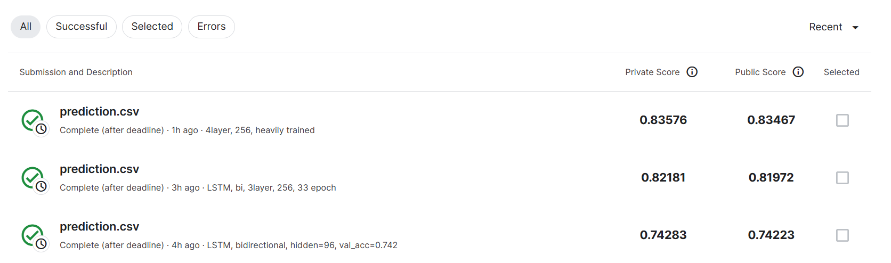

# ML2022Spring-hw2

Kaggle competition site: [ML2022Spring-hw2](https://www.kaggle.com/competitions/ml2022spring-hw2/overview)

LibriSpeech phoneme classification

用循环神经网络做，一定要用双向网络，因为单点上的识别必定需要该点前后的语音资料，而单向网络只能为它提取前面部分语音资料的统计信息。

上 4 层双向 LSTM，调好 dropout 和 lr，一通猛炼即可。